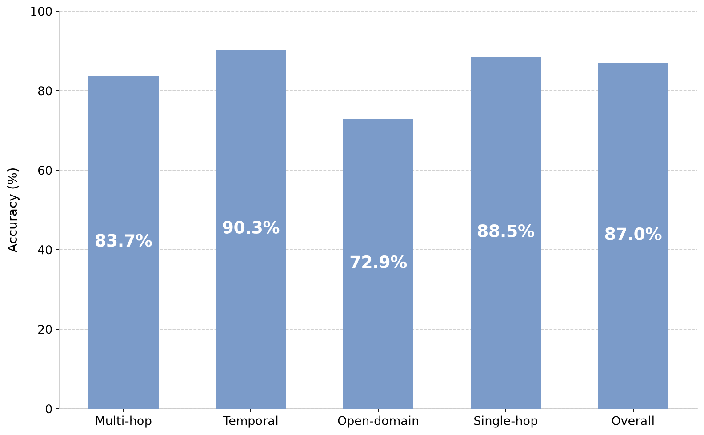

# LoCoMo Benchmark Results

This section summarizes how Memori’s Advanced Augmentation performed on the LoCoMo benchmark. Using our LLM-as-a-Judge framework, we evaluated four reasoning categories (Multi-Hop, Temporal, Open-Domain, and Single-Hop) and compared Memori against several memory baselines and a Full-Context ceiling. We also examined the vital tradeoff between output accuracy and token cost efficiency. The results are presented in Table 1\.

| Table 1: LLM-as-a-Judge Evaluation Results on the LoCoMo Benchmark |  |  |  |  |  |
| ----- | :---: | :---: | :---: | :---: | :---: |
| Method | Single-hop (%) | Multi-hop (%) | Open-domain (%) | Temporal (%) | Overall (%) |
| Memori | 88.5 | 83.7 | 72.9 | 90.3 | 87.0 |
| Zep | 79.43 | 69.16 | 73.96 | 83.33 | 79.09 |
| LangMem | 74.47 | 61.06 | 67.71 | 86.92 | 78.05 |
| Mem0 | 62.41 | 57.32 | 44.79 | 66.47 | 62.47 |
| Full-Context (Ceiling) | 88.53 | 77.70 | 71.88 | 92.70 | 87.52 |

<Note>This table compares the factual accuracy and reasoning capabilities of Memori’s Advanced Augmentation assets against state-of-the-art baselines and a full-context ceiling. Memori performance values were computed using the average of three rounds.</Note>

Graphical representation of Memori's average accuracy along with the standard deviation is presented in Figure 2\.

## **Overall Performance**

As expected, the Full-Context setup achieved the highest score (87.52%). However, passing the entire conversation history into the prompt is fundamentally impractical in production due to prohibitive token costs, uncontrolled context expansion, and context degradation over time.

Among retrieval-based systems, Memori achieved a leading overall score of 87.0%, successfully outperforming Zep (79.09%), LangMem (78.05%), and Mem0 (62.47%). This validates the assumption that by structuring unstructured chat logs into semantic triples and summaries, Memori effectively isolates high-signal knowledge. This structured memory design significantly narrows the gap to the Full-Context ceiling while keeping context windows highly manageable and operational token costs low.

## **Performance by Category**

Analyzing the results across reasoning categories highlights the specific strengths of Memori's extracted memory assets:

* **Single-Hop Reasoning (88.5%):** Memori excels in direct fact retrieval, outperforming both LangMem (74.47%) and Zep (79.43%). By minimizing conversational noise and structuring data cleanly, the LLM is fed exact, undeniable facts, minimizing token consumption while maximizing direct recall.
* **Temporal Reasoning (90.3%):** Memori outperforms Mem0 (66.47%), Zep (83.33%), and LangMem (86.92%) in temporal tracking. Memori’s structured summaries effectively rebuild the timeline of user state changes across sessions, delivering the strongest temporal reasoning of all retrieval-based systems evaluated.
* **Multi-Hop Reasoning (83.7%):** Memori performs strongly when asked to connect disparate pieces of information, outperforming Zep (69.16%) and LangMem (61.06%). The combination of precise triples and cohesive summaries provides the necessary backdrop that helps the LLM connect isolated facts without needing the entire conversational transcript injected into the prompt.
* **Open-Domain Reasoning (72.9%):** This category remains challenging across all retrieval-based systems. Open-ended questions often lack clear retrieval anchors, making them difficult to match with granular triples. Furthermore, these queries require broad synthesis across massive contexts rather than simple fact extraction. Memori outperforms LangMem (67.71%) here, though improving open-domain scores typically requires retrieving significantly larger chunks of text, which actively works against the system's core operational goal: strictly minimizing the number of tokens added to the context to control API costs.

## **Token Usage and Cost Efficiency**

Traditional memory architectures and standard RAG setups often rely on retrieving raw, uncompressed text chunks. This indiscriminately injects conversational noise and redundant dialogue into the prompt, consuming context limits and inflating API bills.

Memori’s Advanced Augmentation pipeline completely bypasses this inefficiency by acting as an intelligent cognitive filter. Rather than retrieving raw text, it compresses chat logs into structured representations, including dense semantic triples and concise conversation-level summaries.  As a result, only high-signal, structured information is passed to the LLM, minimizing context overhead while preserving relevant context.

| Table 2: Token Usage and Cost Efficiency |  |  |  |
| ----- | :---: | :---: | :---: |
| Method | Added Tokens to Context (mean) | Context Cost ($) | Context Footprint (%) |
| **Memori** | **721** | **0.000577** | **2.8** |
| Full-context | 26,031 | 0.020825 | 100.00 |
| Mem0 | 1,764 | 0.001411 | 6.78 |
| Zep | 3,911 | 0.003129 | 15.02 |

<Note>  This table analyzes the operational efficiency of each method by measuring the absolute number of tokens added to the context and the resulting cost per query. Costs are computed based on current gpt-4.1-mini pricing: $0.8 per 1M tokens.</Note>

Memori requires an average of only 721 tokens to ground each LLM response. This token footprint represents just 2.8% of the full conversational context, while achieving the 87.0% overall accuracy detailed in the previous section.

When compared to competing memory frameworks, the operational advantages become even more pronounced:

* **Compared to Zep (3,911 tokens):** Memori reduces the prompt size by roughly 82% per query, directly cutting API inference costs by the same margin, while simultaneously delivering a higher accuracy score (87.0% vs. 79.09%).
* **Compared to the Full-Context approach (26,031 tokens):** Passing the entire history is financially unsustainable for persistent agents, costing over 36 times more per turn than Memori. Furthermore, repeatedly injecting 26K+ tokens drastically increases the risk of "lost in the middle" hallucinations.

## **Conclusion**

For LLM agents to scale in production, persistent memory must address two fundamental challenges: context degradation and rapidly increasing token costs. Memori approaches this not as a storage issue, but as a data structuring problem.

Through its Advanced Augmentation memory creation pipeline, Memori transforms noisy conversational logs into compact, high-signal representations, combining precise semantic triples with coherent conversation-level summaries. This dual representation enables accurate fact retrieval alongside strong temporal and contextual reasoning, without inflating the prompt with unnecessary tokens.

Our evaluation on the LoCoMo benchmark demonstrates the effectiveness of this approach:

* **High-Quality Reasoning:** Memori achieves state-of-the-art performance among retrieval-based systems, with particularly strong gains in temporal and single-hop reasoning \- highlighting the impact of structured memory on reasoning fidelity.
* **Minimal Context Footprint:** Responses are grounded using a small fraction of the original conversation, showing that well-structured memory can replace large, unfiltered context without sacrificing accuracy.
* **Cost-Efficient Scaling:** By significantly reducing the number of tokens injected into the prompt, Memori directly lowers inference costs and enables sustainable deployment of long-running agents.

These results highlight a fundamental shift in memory design for LLM systems: performance is determined not by how much context is used, but by the quality of its structure.

Memori eliminates the traditional tradeoff between reasoning quality and operational cost. By delivering accurate, cross-session recall with a compact context footprint, it provides a practical and scalable foundation for deploying persistent AI agents in real-world environments.
