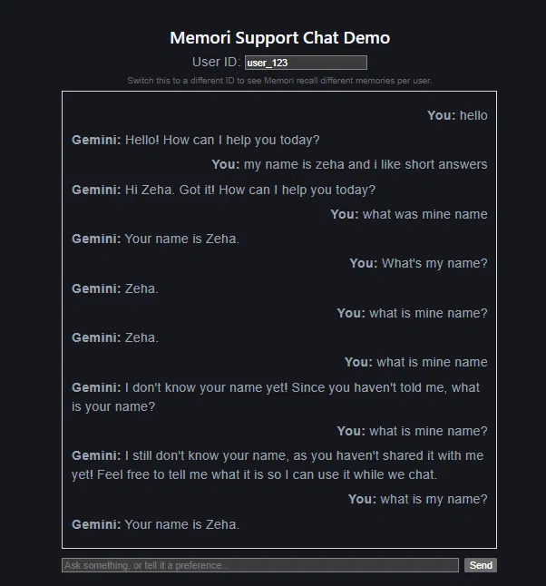

# Memori Support Chat Demo (React + Node + Gemini)

A minimal full-stack demo showing Memori's per-user memory recall using Google Gemini.

## What this demonstrates
- Wrapping a Gemini client with `Memori().llm.register(client)`
- Per-user memory isolation via `mem.attribution(userId, processId)`
- Automatic fact recall across separate messages — with no manual conversation history sent by the app

## Setup

### Backend
\`\`\`bash
cd backend
npm install
# create a .env file with:
# MEMORI_API_KEY=your_key
# GEMINI_API_KEY=your_key
# PORT=4000
npm run dev
\`\`\`

### Frontend
\`\`\`bash
cd frontend
npm install
npm run dev
\`\`\`

Open http://localhost:5173

## Demo script
1. Set User ID to `user_123`, send: "My name is Zeha and I like short answers."
2. Ask: "What's my name?" → Memori recalls it correctly.
3. Switch User ID to a new value (e.g. `user_456`), ask: "What's my name?" → correctly returns no memory, proving per-user isolation.

